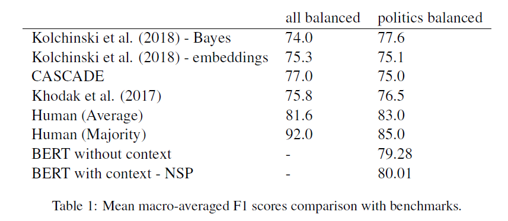

# BERT Sarcasm Detection
Błażej Dolicki
i6155906

## Why sarcasm detection?
## Current trends in sarcasm detection
1. Context representation.
2. User representation.
## BERT - pretrained language model
- versatile model that can be used for various tasks
- quick - only up to 40 mins of training on K80
## Results

## Future work
- BERT - Feature-based approach
- BERT with User Embeddings based on Kolchinski et al., 2018
